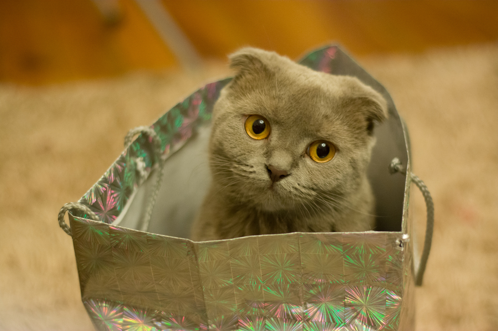
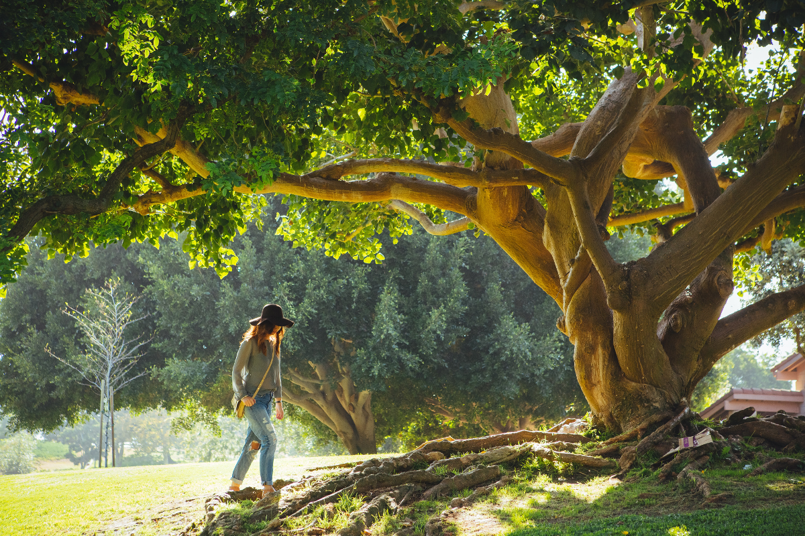

# Images (jpeg, png, tiff, bmp)

Depending on the output format, using images inside a document can create unexpected results.

TeX based PDFs for example do not place the image at the place where it's been specified in the text.
For better reading, the image is placed to fit the flow of the text - a nice intention that sometimes
results in a cluster of pages at the end of a chapter.

EPUB on the other hand places the images where intended, on your eReader this might result in half
empty pages, because the image is pushed to the next page.

HTML files will create relative paths like:

~~~

~~~
... and you need to make sure that the images will manually be placed in the relative folder.

However, here are a few images with different image formats. Live and learn.
 

 

 

\pagebreak

\pagebreak

